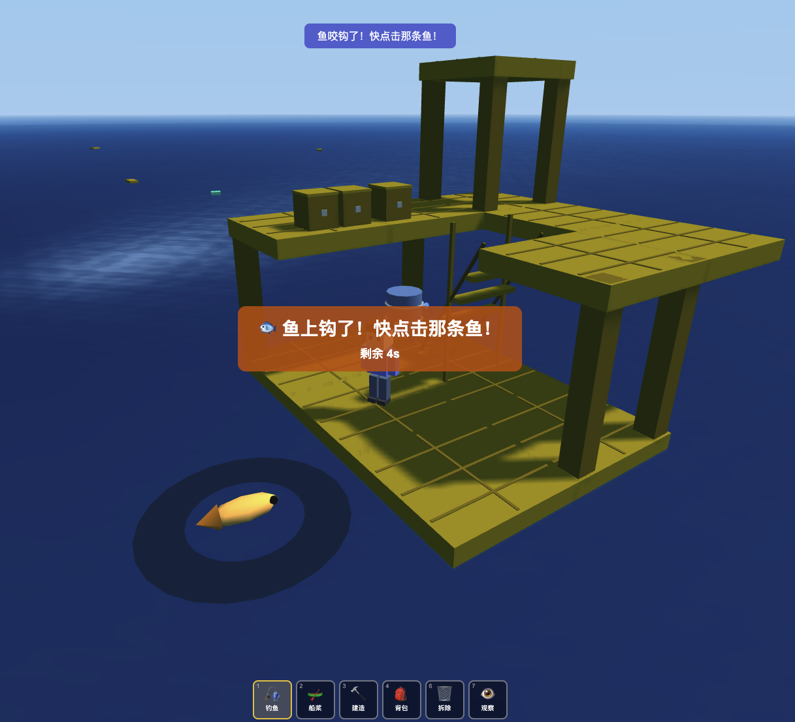

## Raft

这是一个完全使用 Claude Opus 4.6 模型编写的单文件 3D 游戏，旨在探索 AI 的代码生成能力。

玩家在一个无限延展的海面上生存、建造和探索。可以使用钩子获取物资，使用船桨划船，并通过建造面板扩展木筏，可以建造成多层结构。

### Features

- [x] 无限海面，随机刷出物资
- [x] 钩子抓取物资，船桨划船
- [x] WASD 控制小人在木筏上行走、QE 调整视角、鼠标滚轮调整视距
- [x] 建造面板扩建木筏
- [x] 多层结构建造，建造柱子、楼梯和多层地板
- [x] 支持拆除
- [ ] 建造鱼竿、淡水净化器，钓鱼
- [ ] 小人饥饿值、烹饪系统
- [ ] 建设风帆和调整方向
- [ ] 建造自动物资采集网
- [ ] 刷新种子、收集泥板和种植系统
- [ ] 贴图优化
### 渲染

水面、天空与太阳光照移植自 [Clearwater](https://github.com/Aureliengmz/clearwater)（MIT License, © 2026 Lumaris）：GPU FFT 海浪频谱、物理 Fresnel、Beckmann 太阳高光（LEAN 方差抗闪烁）、水体散射、互动涟漪（钩子/钓鱼水花、木筏尾迹），以及 HDR 泛光 + 星芒眩光 + ACES 色调映射。

URL 参数：`?debug` 显示帧率/分辨率/绘制调用数，`?q=0.7` 固定渲染分辨率比例（默认自适应）。
